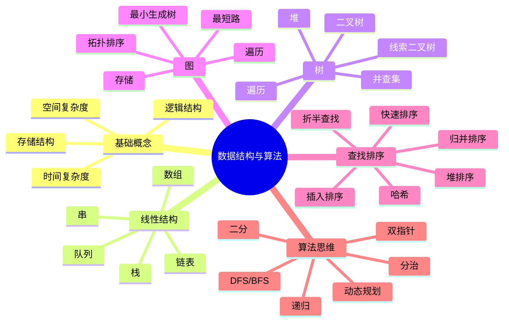
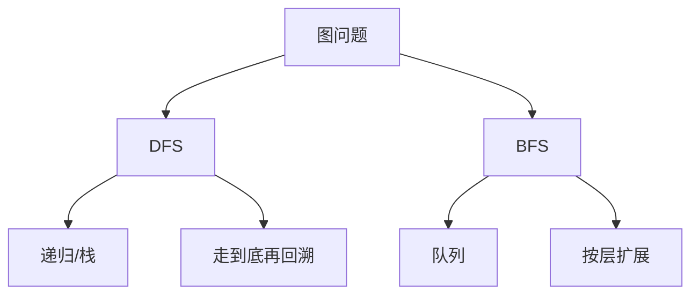

# 数据结构与算法

> 写作定位：以 408 数据结构为主，兼顾常见算法面试套路。  
> 目标读者：有一点计算机基础，希望兼顾应试与面试表达。  
> 全局规范：见 `408笔记写作规范.md`

## 1. 本章学习目标

- 建立数据结构主干知识图谱
- 把线性结构、树、图、查找、排序串起来
- 能说清常见结构“为什么这样设计”
- 能应对 408 高频选择题、综合题与基础面试题

## 2. 章节导图

## 3. 核心知识展开

### 3.1 先把全局认识搭起来

很多同学学数据结构时会有一种割裂感：数组是一章，树是一章，图又是一章，排序单独一章，算法题又像另一个世界。实际上它们是一条线。

这条线可以概括为：

1. **先决定数据怎么组织**
2. **再决定数据怎么存**
3. **最后决定怎么高效地处理这些数据**

所以，“数据结构”回答的是**数据如何组织与存储**，“算法”回答的是**如何在这些结构上高效完成任务**。

可以把它理解成：

- 数据结构像仓库的货架布局
- 算法像仓库里拿货、补货、盘点的流程

如果货架设计得不好，再聪明的工人也会浪费时间；如果流程设计得不好，再好的货架也发挥不出价值。

### 3.2 数据结构的三组基础概念

#### 3.2.1 逻辑结构与存储结构

逻辑结构看的是“关系”，存储结构看的是“落地方式”。

| 维度 | 关注点 | 典型例子 |
| --- | --- | --- |
| 逻辑结构 | 元素之间在概念上怎么关联 | 线性、树形、图形 |
| 存储结构 | 在内存中怎么放 | 顺序存储、链式存储、索引存储、散列存储 |

一个经典例子是线性表：

- 从逻辑上看，它是一串有先后顺序的元素
- 从存储上看，它既可以用数组顺序存，也可以用链表链式存

所以同一个逻辑结构，可能对应多种存储方式；不同的存储方式，又会直接影响操作效率。

#### 3.2.2 时间复杂度与空间复杂度

复杂度不是在算“程序跑了几秒”，而是在看**当数据规模 n 变大时，增长趋势是什么**。

常见复杂度从优到劣大致如下：

| 复杂度 | 名称 | 直觉理解 |
| --- | --- | --- |
| `O(1)` | 常数级 | 数据再多也几乎一样快 |
| `O(log n)` | 对数级 | 每次砍掉一半，如二分查找 |
| `O(n)` | 线性级 | 数据量翻倍，工作量也翻倍 |
| `O(n log n)` | 线性对数级 | 高效排序的常见上界 |
| `O(n^2)` | 平方级 | 双重循环常见 |
| `O(2^n)` | 指数级 | 通常意味着算法很慢 |

要特别注意三点：

- 复杂度分析通常忽略常数、低阶项和系数
- 最坏时间复杂度最常用
- 空间复杂度看的是额外辅助空间，不只是输入本身占用

#### 3.2.3 为什么要学复杂度

因为算法题和面试题本质上经常都在问一件事：**你有没有意识到更优的方法**。

比如找一个数：

- 无序数组里顺序找：`O(n)`
- 有序数组里二分找：`O(log n)`
- 哈希表里查找：平均 `O(1)`

同样是“查找”，效率可以差很多。

### 3.3 线性表：最基础也最重要

线性表是最基础的逻辑结构，特点是“一个前驱、一个后继”，除了首尾元素，其他元素都处在一条线里。

408 中最核心的是：**顺序表和链表的对比**。

#### 3.3.1 顺序表

顺序表底层通常就是连续内存空间，也就是数组思维。

它的优点：

- 支持按下标随机访问，访问第 `i` 个元素很快
- 存储密度高，不需要额外指针

它的缺点：

- 插入删除要移动大量元素
- 容量可能受限制，扩容有代价

#### 3.3.2 链表

链表不要求物理上连续，靠指针把节点串起来。

它的优点：

- 插入删除灵活，尤其在已知位置的情况下效率高
- 不要求连续存储空间

它的缺点：

- 不能随机访问
- 需要额外存指针
- 缓存局部性差，实际运行时常比数组慢

下面这张表是高频对比：

| 操作 | 顺序表 | 链表 |
| --- | --- | --- |
| 按位查找 | `O(1)` | `O(n)` |
| 按值查找 | `O(n)` | `O(n)` |
| 尾部追加 | 平均较快 | 若有尾指针可快，否则 `O(n)` |
| 中间插入删除 | `O(n)` | 找到位置后 `O(1)` |
| 空间利用 | 高 | 需要额外指针域 |

#### 3.3.3 面试角度怎么讲数组和链表

面试时不要只说“数组查找快，链表插入快”，这样太浅。更好的说法是：

- 数组快在**连续内存 + 支持随机访问**
- 链表插入删除快，是因为**不用移动后续元素**
- 但链表找位置并不快，所以“链表插入快”是有前提的

#### 3.3.4 单链表、双链表、循环链表

| 结构 | 特点 | 适用场景 |
| --- | --- | --- |
| 单链表 | 每个节点一个后继指针 | 结构简单 |
| 双链表 | 同时能找前驱和后继 | 删除当前节点更方便 |
| 循环链表 | 尾节点再指向头节点 | 适合循环处理问题 |

### 3.4 栈和队列：受限线性表

栈和队列非常像，但操作规则完全不同。

| 结构 | 规则 | 典型场景 |
| --- | --- | --- |
| 栈 | 后进先出 LIFO | 函数调用、表达式求值、括号匹配、DFS |
| 队列 | 先进先出 FIFO | 任务排队、缓冲区、层序遍历、BFS |

#### 3.4.1 栈为什么重要

栈的本质是“最近进入的内容，最先被处理”。

函数递归调用时，系统就是用栈保存：

- 返回地址
- 局部变量
- 参数信息

所以很多递归题都可以改写成显式栈。

#### 3.4.2 队列为什么重要

队列特别适合“按到达顺序处理”的任务。

比如图的广度优先遍历、树的层序遍历，本质上都在做一件事：**先访问当前层，再处理下一层**。

#### 3.4.3 循环队列是高频考点

普通顺序队列如果只会“rear 后移”，很容易出现假溢出：前面已经空了，后面却不能继续入队。

循环队列的核心思想是：**把存储空间首尾连起来看成一个环**。

循环队列常考两个问题：

- 队空条件
- 队满条件

最常见的做法是牺牲一个存储单元，约定：

- 队空：`front == rear`
- 队满：`(rear + 1) % MaxSize == front`

### 3.5 串、数组与 KMP：别把它们看成碎知识

#### 3.5.1 串是什么

串就是字符构成的线性表，重点不在“它由字符组成”，而在**它的操作非常依赖模式匹配**。

常见考法：

- 求子串
- 比较两个串
- 模式匹配

#### 3.5.2 朴素模式匹配为什么慢

假设主串中当前位置匹配失败，朴素算法通常是主串右移一位，模式串重新从头开始比较。

这就导致很多“已经知道的信息”没有被利用。

#### 3.5.3 KMP 的直觉理解

KMP 的核心不是“next 数组难背”，而是：

> 当某一位失配时，模式串不要回到最开始，而是跳到一个“仍然有可能匹配成功”的位置。

这个位置由“前缀”和“后缀”的最长公共部分决定。

你可以把 KMP 理解成：

- 朴素算法：失败了几乎从头来
- KMP：失败后尽量复用已经匹配过的信息

从面试角度，能讲清这句话就已经很好了，不必执着于极细的 next 变种写法。

### 3.6 树：把层次结构真正搞懂

树是非线性结构里最重要的一类，因为很多现实问题天然就是树形的：

- 文件目录
- 组织架构
- 编译语法树
- HTML DOM

#### 3.6.1 树的基本概念

要掌握这些术语：

- 结点
- 根结点
- 双亲、孩子、兄弟
- 叶子结点
- 结点的度
- 树的高度

二叉树是每个结点最多只有两个孩子的树。

#### 3.6.2 二叉树为什么是重中之重

因为它结构简单、表达能力强，很多更复杂的树结构都可以往它身上类比。

二叉树最核心的内容有：

- 性质
- 遍历
- 存储
- 特殊二叉树

#### 3.6.3 四种遍历必须会

| 遍历方式 | 访问顺序 | 常见用途 |
| --- | --- | --- |
| 先序 | 根-左-右 | 适合复制树、前缀表达 |
| 中序 | 左-根-右 | 二叉排序树中得到有序序列 |
| 后序 | 左-右-根 | 适合先处理子问题再处理整体 |
| 层序 | 从上到下、从左到右 | 借助队列，体现层级关系 |

一个非常重要的理解是：

- 深度优先遍历常借助栈或递归
- 层序遍历本质是广度优先遍历，借助队列

#### 3.6.4 满二叉树、完全二叉树别混

| 概念 | 含义 |
| --- | --- |
| 满二叉树 | 每一层都满 |
| 完全二叉树 | 只有最后两层可能不满，且最后一层结点集中在左边 |

完全二叉树很重要，因为它适合顺序存储，这也是堆通常用数组实现的原因。

#### 3.6.5 线索二叉树的本质

普通二叉树里有些空指针其实浪费了。线索二叉树就是利用这些空指针，把遍历前驱或后继信息存进去。

它的意义在于：

- 让某种遍历下的前驱后继查找更方便
- 减少遍历时对栈或递归的依赖

#### 3.6.6 二叉排序树、平衡树、堆

这三者特别容易混。

| 结构 | 核心性质 | 主要用途 |
| --- | --- | --- |
| 二叉排序树 BST | 左小右大 | 快速查找 |
| 平衡二叉树 AVL | 保持左右高度差受控 | 防止 BST 退化 |
| 堆 | 父结点与孩子满足大小关系 | 快速取最值 |

要注意：

- 堆不是“完全有序”
- 堆只能保证堆顶最大或最小
- BST 的中序遍历有序，但堆的中序遍历不一定有序

#### 3.6.7 并查集的价值

并查集经常出现在图问题里，用来判断两个元素是否属于同一个集合。

它擅长两件事：

- 查找某个元素属于哪个集合
- 合并两个集合

典型场景：

- 判断连通性
- Kruskal 最小生成树

### 3.7 图：最容易难，但也最成体系

图比树更一般，因为树可以看作一种特殊图。

图要先掌握两件事：

1. 怎么存
2. 怎么遍历

#### 3.7.1 图的存储

最常见的是邻接矩阵和邻接表。

| 存储方式 | 优点 | 缺点 | 适用情况 |
| --- | --- | --- | --- |
| 邻接矩阵 | 判断边是否存在很快 | 空间开销大 | 稠密图 |
| 邻接表 | 节省空间 | 查某条边是否存在没那么直接 | 稀疏图 |

#### 3.7.2 DFS 与 BFS

这两个是图算法的根。

| 算法 | 核心数据结构 | 特点 | 常见用途 |
| --- | --- | --- | --- |
| DFS | 栈 / 递归 | 一条路走到底再回退 | 连通性、回溯、拓扑思路 |
| BFS | 队列 | 一层一层扩展 | 最短层数、无权图最短路 |

#### 3.7.3 最小生成树

最小生成树解决的是：在一个连通带权无向图中，选出若干条边，把所有顶点连起来，并且总权值最小。

高频算法是：

- Prim：更像“从点出发，不断扩张”
- Kruskal：更像“从边出发，按权值从小到大挑边”

对比记忆：

| 算法 | 思想 | 适合 |
| --- | --- | --- |
| Prim | 从一个顶点开始逐步扩展 | 稠密图 |
| Kruskal | 边排序后逐条尝试加入 | 稀疏图 |

#### 3.7.4 最短路径

最短路径问题要先问清楚：**边权是否可能为负**。

408 常见掌握层面：

- Dijkstra：适合无负权边
- Floyd：求任意两点最短路径，适合点数较少时的整体求解

面试里最常见的一句话是：

- 无权图最短路优先想到 BFS
- 非负权图单源最短路优先想到 Dijkstra

#### 3.7.5 拓扑排序与关键路径

拓扑排序只适用于 **有向无环图 DAG**。

它的意义是处理“先做谁、后做谁”的依赖关系，比如：

- 编译顺序
- 课程先修关系
- 项目任务依赖

关键路径则常用于带权 DAG，用来找**完成整个工程所需的最短总工期中，不能拖延的那条主链**。

### 3.8 查找：先想能不能利用已有信息

#### 3.8.1 顺序查找

最朴素，但适用范围最广，因为不要求有序。

#### 3.8.2 折半查找

二分查找最重要的前提是：**序列有序 + 能随机访问**。

所以：

- 数组适合二分
- 链表不适合标准二分

很多人学二分只记模板，不记本质。本质其实是：

> 每次比较后，排除一半不可能的区间。

#### 3.8.3 哈希查找

哈希的核心思想是“用空间换时间”，希望通过哈希函数把关键字直接映射到某个位置。

它平均查找很快，但要注意两个问题：

- 哈希冲突不可避免
- 哈希表通常不支持有序访问

常见冲突处理：

- 开放定址法
- 链地址法

面试中经常问：

- 为什么哈希查找快
- 为什么哈希表不适合范围查询
- 为什么负载因子高了性能会下降

### 3.9 排序：408 和面试都特别爱考

排序是最容易形成体系的一章，因为它很适合横向对比。

#### 3.9.1 几个最核心的排序

| 排序算法 | 平均时间复杂度 | 是否稳定 | 核心特点 |
| --- | --- | --- | --- |
| 直接插入排序 | `O(n^2)` | 稳定 | 小规模或基本有序时效果不错 |
| 冒泡排序 | `O(n^2)` | 稳定 | 思想简单，但整体较慢 |
| 简单选择排序 | `O(n^2)` | 不稳定 | 每轮选最小值 |
| 希尔排序 | 介于 `O(n)` 到 `O(n^2)` 之间 | 不稳定 | 分组插入，属于优化插入排序 |
| 归并排序 | `O(n log n)` | 稳定 | 分治经典，需要额外空间 |
| 快速排序 | 平均 `O(n log n)` | 不稳定 | 实战非常常用，最坏 `O(n^2)` |
| 堆排序 | `O(n log n)` | 不稳定 | 适合维护最值 |

#### 3.9.2 为什么快排常用

因为快排平均性能很好，常数因子也小，工程实践中经常表现优秀。

但要注意：

- 快排最坏会退化到 `O(n^2)`
- 当分区极不均匀时性能变差
- 可以通过随机选基准、三数取中等方式优化

#### 3.9.3 为什么归并值得重视

归并排序最稳定、思路最清晰，也非常适合链表排序。

很多面试题虽然表面不是排序，底层思路却和归并类似，比如：

- 统计逆序对
- 合并多个有序序列

#### 3.9.4 稳定性怎么理解

若两个关键字相等的元素，排序后相对次序不变，则称排序稳定。

稳定性的意义通常体现在“多关键字排序”中。

例如先按班级排，再按成绩排，如果第二次排序是稳定的，那么第一次排序形成的班级内相对顺序不会被破坏。

### 3.10 常见算法思想：给面试打基础

这一部分不完全属于 408 的传统目录，但特别值得补充，因为它能把“知识点”变成“会做题”。

#### 3.10.1 递归

递归本质是：

- 把大问题拆成相似的小问题
- 用函数自己调用自己
- 最终靠边界条件停下来

递归要看三件事：

1. 递归函数含义是什么
2. 递推关系是什么
3. 终止条件是什么

#### 3.10.2 分治

分治常见流程：

经典例子：

- 归并排序
- 快速排序
- 二分查找

#### 3.10.3 双指针

双指针特别适合处理：

- 有序数组
- 区间问题
- 链表问题
- 滑动窗口问题

常见形式：

- 左右指针
- 快慢指针
- 滑动窗口

比如判断链表是否有环，快慢指针就是高频经典题。

#### 3.10.4 DFS / BFS

当你看到：

- 全排列
- 组合
- 子集
- 树路径
- 图连通性

常常要想到 DFS。

当你看到：

- 最少步数
- 最短层数
- 一圈一圈扩散

常常要想到 BFS。

#### 3.10.5 动态规划

动态规划经常被觉得难，其实入门只要抓住四步：

1. 状态是什么
2. 状态转移方程是什么
3. 初始条件是什么
4. 计算顺序是什么

你可以把 DP 理解成：**把重复子问题的答案记下来，避免重复计算**。

典型题：

- 斐波那契数列
- 爬楼梯
- 最长上升子序列
- 01 背包

对 408 来说，不要求把所有高难 DP 都吃透，但至少要具备“看到重复子问题，想到记忆化或 DP”的意识。

## 4. 高频考点总结

### 4.1 408 高频主线

- 顺序表与链表的存储特点、基本操作复杂度
- 栈和队列的基本性质，循环队列判空判满
- 二叉树的性质、遍历、线索化
- 完全二叉树和堆的关系
- 图的存储结构、DFS、BFS
- 最小生成树、最短路径、拓扑排序
- 折半查找的前提
- 哈希冲突处理
- 各类排序算法的时间复杂度、稳定性、适用场景

### 4.2 面试高频主线

- 数组和链表怎么选
- 栈和队列有哪些经典应用
- 二叉树遍历怎么写，递归和非递归有什么区别
- 堆和二叉搜索树有什么区别
- DFS 和 BFS 分别适合什么题
- 快排、归并、堆排各自优缺点
- 二分查找为什么要求有序
- 哈希表为什么查询快，代价是什么

### 4.3 一张总表快速记忆

| 模块 | 最该记住的一句话 |
| --- | --- |
| 顺序表 | 查询快，插删常常慢 |
| 链表 | 插删灵活，但随机访问差 |
| 栈 | 后进先出，适合回退 |
| 队列 | 先进先出，适合按层处理 |
| 二叉树遍历 | DFS 常用递归/栈，层序靠队列 |
| 堆 | 只保证堆顶最值，不保证整体有序 |
| BFS | 无权图最短路优先想到它 |
| 二分 | 有序 + 随机访问 |
| 哈希 | 平均快，但会冲突、通常无序 |
| 排序 | 快排常用，归并稳定，堆排稳上界 |

## 5. 易错点 / 易混点

### 5.1 顺序表和数组不是完全等价词

顺序表强调的是**顺序存储的线性表**，数组更偏向一种具体存储形式。日常里常混着说，但考试里最好知道它们的语境差异。

### 5.2 “链表插入快”有前提

如果连插入位置都不知道，仍然要先遍历找位置，这一步可能就是 `O(n)`。

### 5.3 栈和队列不要只背英文缩写

- 栈是后进先出
- 队列是先进先出

真正重要的是理解它们解决的问题类型。

### 5.4 完全二叉树不等于满二叉树

满二叉树要求每层都满；完全二叉树允许最后一层不满，但必须从左往右连续。

### 5.5 二叉排序树不等于堆

- BST 强调左小右大
- 堆强调父子大小关系

一个能中序有序，一个不能。

### 5.6 DFS 不一定比 BFS 快

它们不是简单的快慢关系，而是适合不同问题。

- DFS 适合搜索全部可能、回溯
- BFS 适合最少步数、最短层数

### 5.7 二分查找不是“看到查找就用”

必须满足有序，且最好支持随机访问。

### 5.8 快速排序不是永远最优

它平均优秀，但不稳定，且最坏可能退化。要会说出它和归并、堆排序的差异。

## 6. 面试常问

### 6.1 数组和链表有什么区别

**回答模板：**

数组底层是连续内存，支持随机访问，所以按下标访问很快；但中间插入删除通常要移动大量元素。链表节点在内存中不要求连续，插入删除更灵活，但不支持高效随机访问，而且还要额外空间存指针。实际选择时，如果读多写少、需要频繁按下标访问，通常更偏向数组；如果插入删除频繁，尤其是在已知位置附近操作较多，链表更合适。

### 6.2 栈和队列在实际中有什么用

**回答模板：**

栈适合处理具有“回退”性质的问题，比如函数调用、表达式求值、括号匹配、深度优先搜索；队列适合按先来后到处理任务，比如消息队列、任务调度缓冲、广度优先遍历、树的层序遍历。

### 6.3 二叉树遍历你怎么理解

**回答模板：**

先序、中序、后序本质上都是深度优先遍历，只是访问根节点的时机不同；层序遍历则是广度优先遍历，需要借助队列。从应用上看，中序遍历在二叉搜索树里特别重要，因为它能得到有序序列。

### 6.4 堆和红黑树、二叉搜索树有什么差别

如果只是基础面试，不必一上来讲太多红黑树细节。先说清楚：

- 堆适合快速拿最值
- 二叉搜索树适合查找有序关系
- 平衡搜索树是在 BST 基础上避免退化

### 6.5 为什么哈希表查找快

因为它希望通过哈希函数直接把 key 映射到存储位置，理想情况下接近一次定位。但快的代价是：

- 可能冲突
- 需要设计哈希函数和扩容机制
- 通常不保序

### 6.6 什么时候用 DFS，什么时候用 BFS

**一句话版：**

- 找所有方案、路径搜索、回溯：优先 DFS
- 找最少步数、最短层数：优先 BFS

### 6.7 快排和归并排序怎么选

**回答模板：**

快速排序平均性能优秀、原地性较好，工程中常用；归并排序时间复杂度稳定为 `O(n log n)`，而且是稳定排序，但通常需要额外空间。如果是链表排序或需要稳定性，归并往往更合适。

## 7. 刷题与复习建议

### 7.1 第一阶段：建立结构感

先不要一上来狂刷题，而是先把五大块串起来：

- 线性表
- 树
- 图
- 查找
- 排序

建议先做到：看到一道题，能判断它属于哪一块。

### 7.2 第二阶段：按“数据结构 + 操作”刷题

比如：

- 链表：反转、合并、找环、删除节点
- 栈队列：括号匹配、单调栈、滑动窗口
- 二叉树：遍历、求高度、路径和、最近公共祖先
- 图：遍历、拓扑、最短路
- 排序：手写快排、归并、堆的调整

### 7.3 第三阶段：按“算法思想”归类

把做过的题再抽象成：

- 递归
- 分治
- 双指针
- DFS/BFS
- 动态规划

这样你会发现，很多题只是长得不一样，骨架是一样的。

### 7.4 应对 408 的建议

- 先把选择题高频点背熟
- 对复杂度、二叉树性质、图算法步骤要能快速默写
- 排序要做到“复杂度 + 稳定性 + 适用场景”三位一体记忆

### 7.5 应对面试的建议

不要只会写代码，还要练“说”：

- 这题为什么想到这个结构
- 为什么不用另一个结构
- 时间复杂度和空间复杂度是什么
- 有没有更优解

面试里很多时候不是你不会，而是你说不清。

## 8. 最后速记版

### 8.1 结构速记

- 线性表：一对一
- 树：一对多
- 图：多对多

### 8.2 存储速记

- 顺序存储：访问快，插删常慢
- 链式存储：插删灵活，访问常慢

### 8.3 栈队列速记

- 栈：LIFO，适合回退、递归、DFS
- 队列：FIFO，适合排队、层序、BFS

### 8.4 树图速记

- 二叉树 DFS：先序、中序、后序
- 层序遍历：队列
- 图遍历：DFS 看深度，BFS 看层次

### 8.5 查找速记

- 顺序查找：通用但慢
- 二分查找：有序 + 随机访问
- 哈希查找：平均快，但有冲突

### 8.6 排序速记

- 插入：小规模、基本有序可用
- 归并：稳定，`O(n log n)`
- 快排：平均快，工程常用
- 堆排：适合维护最值，不稳定

### 8.7 算法思想速记

- 递归：定义函数含义
- 分治：拆分、求解、合并
- 双指针：减少重复扫描
- BFS：最少步数
- DFS：枚举/回溯
- DP：记录重复子问题答案

### 8.8 最后一句话总结

学数据结构与算法，最重要的不是背零散结论，而是形成一套稳定思维：

> 先看数据如何组织，再看操作目标是什么，最后选择最合适的结构和算法。

如果你真正建立了这套思维，408 做题会更稳，面试表达也会更像“理解了”，而不是“背过了”。
