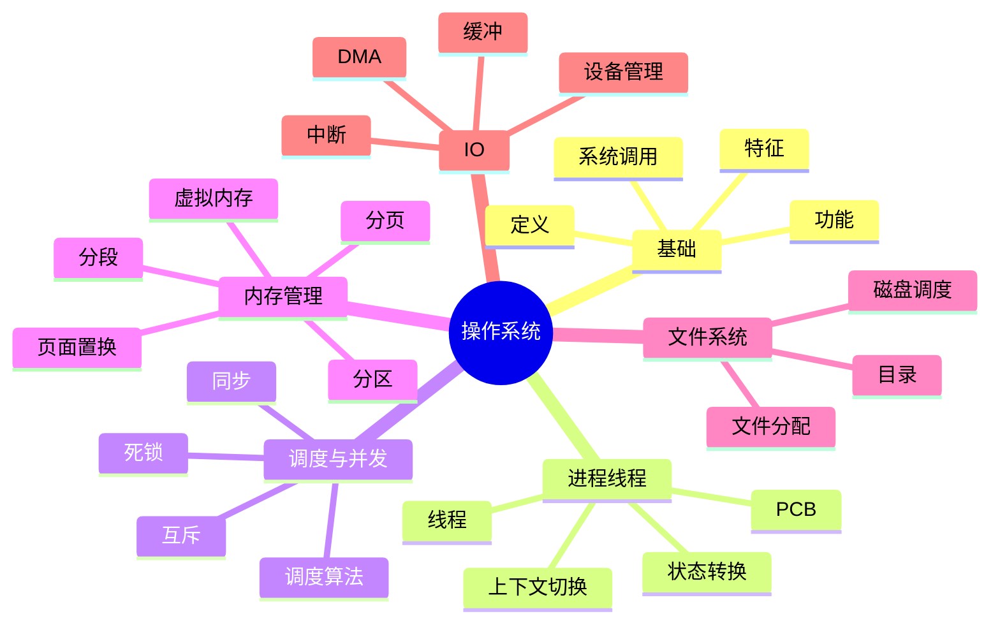
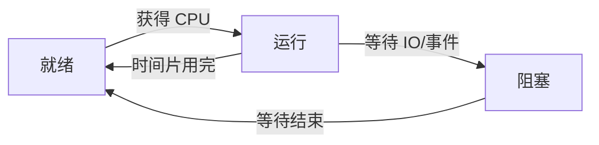
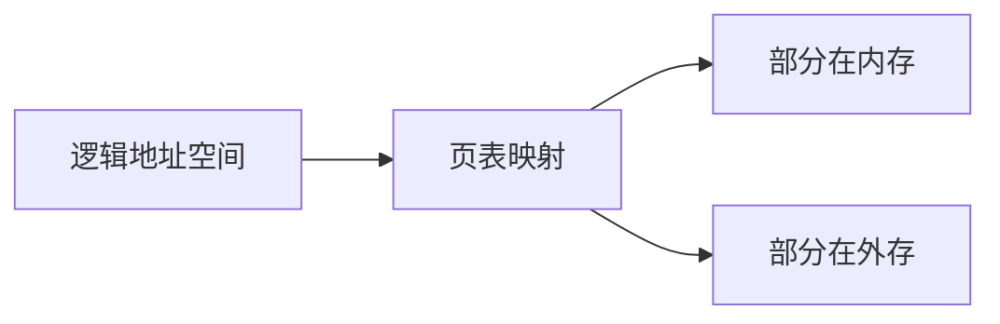

# 操作系统

> 写作定位：以 408 高频考点为主，兼顾面试中最常问的系统基础问题。  
> 目标读者：有一点计算机基础，希望把抽象概念讲明白。  
> 全局规范：见 `408笔记写作规范.md`

## 1. 本章学习目标

- 建立操作系统整体框架
- 理解进程、线程、调度、同步、内存、文件系统主线
- 能把“抽象概念”转化成“运行过程”
- 能回答 408 与面试中的高频 OS 问题

## 2. 章节导图

## 3. 核心知识展开

### 3.1 先建立对操作系统的整体认识

很多同学第一次学操作系统，会觉得它比数据结构更“虚”。因为数据结构能看到数组、链表、树这些具体对象，而操作系统更像一个看不见但无处不在的“管理者”。

从最直观的角度看，操作系统就是：

> **位于硬件和应用程序之间，负责管理资源并提供服务的软件。**

这里有两个关键词：

- **管理资源**
- **提供服务**

资源包括：

- CPU
- 内存
- 磁盘
- 外设
- 文件

服务包括：

- 让程序能运行
- 让多个程序能同时运行而不乱
- 让程序方便地使用硬件，而不用直接操作底层设备

可以把操作系统理解成一家大型酒店的总调度：

- CPU 像前台在分配“办理窗口”
- 内存像房间
- 磁盘像仓库
- 文件系统像档案室
- 进程和线程像正在办理业务的顾客

操作系统的本质，就是让有限资源被**安全、合理、高效**地使用。

### 3.2 操作系统的四个核心特征

408 中经常考的四个关键词是：

- 并发
- 共享
- 虚拟
- 异步

#### 3.2.1 并发

并发不是说同一时刻物理上真的同时执行多个任务，而是说**在一段时间内，多个任务交替推进**。

单核 CPU 上最典型的并发，就是操作系统快速切换任务，让用户感觉多个程序像是在一起运行。

#### 3.2.2 共享

共享指多个执行实体共同使用系统资源。

共享分两类：

- 互斥共享：同一时刻只能一个进程用，比如打印机
- 同时访问：比如多个进程都可以读取某个共享文件

#### 3.2.3 虚拟

虚拟的核心是“把一个物理资源，变成多个逻辑上好像独立、够用的资源”。

典型例子：

- 虚拟内存：让进程感觉自己有很大的连续内存
- 虚拟处理器：让多个进程都“感觉自己在运行”

#### 3.2.4 异步

异步强调的是进程推进速度不一致，运行具有不可预知性。

比如：

- 一个进程等 IO
- 一个进程正在算
- 一个进程被抢占

所以操作系统必须能正确处理这种“走走停停、不整齐”的情况。

### 3.3 操作系统提供了什么

#### 3.3.1 作为资源管理者

它要管理：

- 处理机
- 存储器
- 文件
- 设备

#### 3.3.2 作为用户和硬件之间的接口

用户通常不直接操作硬件，而是通过命令、图形界面、系统调用等方式间接使用资源。

#### 3.3.3 作为扩展机器

硬件本身很底层，很难直接用。操作系统把原始硬件包装成更容易使用的抽象对象，例如：

- 文件
- 进程
- 虚拟地址空间

这就是“扩展机器”的含义。

### 3.4 系统调用：应用程序进入内核的门

系统调用是面试和考试都特别重要的概念。

要牢牢记住：

> 系统调用是应用程序请求操作系统内核提供服务的接口。

用户程序平时运行在用户态，权限较低；当它要执行敏感操作，比如创建进程、申请内存、读写文件，就必须通过系统调用进入内核态。

#### 3.4.1 为什么要分用户态和内核态

因为不能让普通程序直接随便访问所有硬件和关键数据结构，否则系统很容易崩。

这个设计本质上是为了：

- 安全
- 稳定
- 权限控制

#### 3.4.2 系统调用的大致过程

#### 3.4.3 系统调用和函数调用的区别

| 项目 | 普通函数调用 | 系统调用 |
| --- | --- | --- |
| 执行空间 | 用户态 | 需要进入内核态 |
| 权限级别 | 低权限 | 高权限参与 |
| 开销 | 相对较小 | 更大，因为涉及模式切换 |
| 用途 | 完成普通逻辑 | 请求操作系统服务 |

### 3.5 进程：资源分配的基本单位

#### 3.5.1 程序和进程别混

这是高频基础题。

| 概念 | 含义 |
| --- | --- |
| 程序 | 静态的指令集合，是一个文件或代码 |
| 进程 | 程序的一次执行过程，是动态的 |

程序像菜谱，进程像真正做菜的过程。

#### 3.5.2 为什么要有进程

因为仅靠“程序”这个静态概念，没法描述运行中的状态，比如：

- 程序运行到哪了
- 正在等什么资源
- 占用了多少内存
- 打开了哪些文件

这些运行信息都要靠进程来描述。

#### 3.5.3 PCB 是进程的核心

PCB（进程控制块）可以理解成操作系统为每个进程建立的“档案”。

它通常记录：

- 进程标识符
- 当前状态
- 程序计数器
- 寄存器信息
- 调度信息
- 内存指针
- 打开的文件信息

面试里常问：

> 为什么说 PCB 是进程存在的唯一标志？

因为操作系统管理进程，本质上就是在管理 PCB。没有 PCB，系统就无法知道这个进程的状态和资源情况。

#### 3.5.4 进程的状态转换

最常见的三态模型：

- 就绪态
- 运行态
- 阻塞态

理解这个图，比死记状态名更重要。

- 就绪：万事俱备，只差 CPU
- 运行：正在占用 CPU
- 阻塞：缺某个条件，暂时不能继续

#### 3.5.5 进程控制

操作系统对进程最常见的控制动作有：

- 创建
- 撤销
- 阻塞
- 唤醒

这些操作的本质，都是在修改 PCB 以及相关队列。

### 3.6 线程：让并发更轻量

#### 3.6.1 线程是什么

线程是 CPU 调度的基本单位，而进程是资源分配的基本单位。

可以简单理解成：

- 进程像“一个工厂”
- 线程像“工厂里的流水线工人”

同一个进程中的线程通常共享：

- 地址空间
- 打开的文件
- 全局变量

但每个线程有自己的：

- 程序计数器
- 寄存器
- 栈

#### 3.6.2 为什么引入线程

因为如果每个并发任务都用独立进程，创建和切换开销太大。

线程的优势：

- 创建更快
- 切换代价更小
- 进程内通信更方便

#### 3.6.3 进程和线程的对比

| 维度 | 进程 | 线程 |
| --- | --- | --- |
| 资源拥有 | 拥有独立资源 | 共享所属进程资源 |
| 调度地位 | 资源分配基本单位 | CPU 调度基本单位 |
| 切换开销 | 较大 | 较小 |
| 通信成本 | 较高 | 较低 |
| 稳定性影响 | 一个进程崩溃一般不影响别的进程 | 一个线程出错可能影响整个进程 |

#### 3.6.4 面试中怎么回答“线程更轻量”

不要只说“线程切换快”，最好补一句原因：

> 因为同一进程内的线程共享地址空间和大部分资源，切换时不需要像进程切换那样大规模更换资源环境，所以代价更低。

### 3.7 调度：决定谁先用 CPU

CPU 是最核心的稀缺资源之一，所以必须决定：

- 谁先运行
- 运行多久
- 什么时候切换

#### 3.7.1 调度的层次

常见可分为：

- 高级调度：决定哪些作业进入内存
- 中级调度：决定哪些进程暂时换出或换入
- 低级调度：决定 CPU 分给哪个就绪进程

408 和面试里最常问的是低级调度，也就是进程调度。

#### 3.7.2 常见调度算法

| 算法 | 思想 | 特点 |
| --- | --- | --- |
| 先来先服务 FCFS | 谁先来先执行 | 简单，但对短作业不友好 |
| 短作业优先 SJF | 估计运行时间短的先执行 | 平均周转时间优秀，但可能饥饿 |
| 高响应比优先 HRRN | 等待越久越可能被选中 | 兼顾短作业和等待时间 |
| 时间片轮转 RR | 每个进程轮流分到时间片 | 公平，适合分时系统 |
| 优先级调度 | 优先级高的先运行 | 灵活，但可能低优先级饥饿 |

#### 3.7.3 抢占式与非抢占式

| 类型 | 含义 |
| --- | --- |
| 非抢占式 | 进程一旦运行，除非主动放弃，否则不会被强行剥夺 CPU |
| 抢占式 | 操作系统可在合适时机强行收回 CPU |

现代操作系统中，更常见的是抢占式，因为它更利于响应速度和公平性。

#### 3.7.4 时间片轮转为什么常见

因为它很符合交互式系统的需求：

- 谁都能较快得到响应
- 不会长期被某个进程霸占

但时间片也不能太大或太小：

- 太大：退化成 FCFS
- 太小：切换过于频繁，开销增大

### 3.8 同步与互斥：并发程序最容易出问题的地方

并发程序最麻烦的点在于：

多个执行流同时操作共享资源时，结果可能出错。

#### 3.8.1 临界资源与临界区

- 临界资源：一次只允许一个进程使用的资源
- 临界区：访问临界资源的那段代码

核心目标就是：

> 让进入临界区的过程受到控制，避免数据不一致。

#### 3.8.2 同步和互斥的区别

| 概念 | 含义 |
| --- | --- |
| 互斥 | 某时刻只允许一个进程访问临界资源 |
| 同步 | 多个进程按一定先后次序配合完成任务 |

互斥强调“不能一起做”，同步强调“要按顺序做”。

#### 3.8.3 实现互斥的典型机制

408 中高频机制有：

- 软件方法（了解思想即可）
- 硬件方法
- 信号量
- 管程

从应试和面试实用角度，最重要的是**信号量**。

#### 3.8.4 信号量的核心思想

信号量本质上是一个整数，加上两个原子操作：

- `P` 操作：申请资源，减 1
- `V` 操作：释放资源，加 1

当资源不够时，执行 `P` 的进程会阻塞。

信号量特别适合解决：

- 互斥问题
- 生产者消费者问题
- 前驱关系同步问题

#### 3.8.5 生产者消费者是必会模型

这个模型同时体现了：

- 互斥：缓冲区访问互斥
- 同步：满了不能生产，空了不能消费

你要真正理解的不是代码模板，而是三种约束：

- 对缓冲区互斥访问
- 空缓冲区不能消费
- 满缓冲区不能生产

#### 3.8.6 为什么会有竞态条件

因为多个线程/进程对共享数据的读写顺序不确定，导致结果依赖执行时序。

只要你能说出“共享数据 + 非原子操作 + 不受控交替执行”，就说明你理解到位了。

### 3.9 死锁：不是卡住这么简单

死锁是面试特别爱问、408 也常考的经典问题。

#### 3.9.1 什么是死锁

多个进程因竞争资源而造成相互等待，若无外力作用，它们都无法继续推进。

#### 3.9.2 死锁产生的四个必要条件

- 互斥
- 不可剥夺
- 请求并保持
- 循环等待

这四个条件必须同时满足。

所以破坏任意一个条件，都可以避免死锁。

#### 3.9.3 处理死锁的三种思路

| 思路 | 含义 | 特点 |
| --- | --- | --- |
| 预防 | 直接破坏某个必要条件 | 保守，但简单直接 |
| 避免 | 动态判断是否会进入不安全状态 | 更灵活，典型是银行家算法 |
| 检测与解除 | 先允许发生，再检测并恢复 | 适合某些实际系统 |

#### 3.9.4 银行家算法理解到什么程度够用

408 里要会基本思想和安全序列判断；面试里通常只要能说清：

> 系统在分配资源前，先判断这次分配后是否仍然存在安全序列，若没有，就拒绝分配。

### 3.10 内存管理：操作系统最核心的一条主线

内存管理很重要，因为程序必须先装入内存才能运行。

内存管理要解决的问题包括：

- 怎么分配
- 怎么保护
- 怎么共享
- 怎么扩充逻辑容量

#### 3.10.1 连续分配和非连续分配

早期思想比较简单，希望给进程一整块连续内存。

但这会带来很多问题，比如：

- 碎片
- 扩展困难
- 利用率不高

后来发展出非连续分配，也就是分页、分段等方案。

#### 3.10.2 页和页框

分页的核心思想是：

- 逻辑地址空间分成固定大小的页
- 物理内存分成同样大小的页框（页帧）

这样进程的各页不必连续放在物理内存中。

#### 3.10.3 分页为什么重要

因为它解决了连续分配的大问题：

- 减少外部碎片
- 便于管理
- 支撑虚拟内存

但它也会带来页表开销和地址转换成本。

#### 3.10.4 分页和分段的区别

这是高频对比题。

| 维度 | 分页 | 分段 |
| --- | --- | --- |
| 划分依据 | 物理管理需要，固定大小 | 逻辑意义，长度可变 |
| 用户感知 | 通常无感 | 更符合程序逻辑 |
| 碎片情况 | 可能有内部碎片 | 可能有外部碎片 |
| 地址结构 | 页号 + 页内偏移 | 段号 + 段内偏移 |

简化记忆：

- 分页更偏向“系统管理方便”
- 分段更偏向“程序逻辑清晰”

#### 3.10.5 快表 TLB

地址转换如果每次都查页表，会慢。

所以系统会用一个高速缓存来保存最近常用的页表项，这就是快表 TLB。

一句话记忆：

> TLB 是“页表项的缓存”，目的是加速虚拟地址到物理地址的转换。

#### 3.10.6 虚拟内存为什么是操作系统的精华

虚拟内存让进程觉得自己拥有一个大而连续的地址空间，但实际上：

- 只有部分页面真正驻留在内存
- 其余部分可以暂时放在外存

这带来两个巨大好处：

- 程序不必一次性全部装入内存
- 可以在有限物理内存上运行更大的程序

#### 3.10.7 缺页中断

当进程访问的页当前不在内存中，就会发生缺页中断，操作系统需要：

1. 暂停当前进程
2. 去外存把所需页面调入
3. 必要时淘汰一个旧页面
4. 更新页表
5. 继续执行

注意：

- 缺页中断属于**内中断**
- 它是一种“正常可恢复”的异常，不是程序错误

#### 3.10.8 页面置换算法

常见算法：

| 算法 | 思想 | 特点 |
| --- | --- | --- |
| OPT | 淘汰未来最长时间不用的页 | 理论最优，用于比较 |
| FIFO | 先进先出 | 简单，但可能 Belady 异常 |
| LRU | 淘汰最近最久未使用的页 | 符合局部性原理，常被视作理想近似 |
| CLOCK | 用访问位近似 LRU | 实现代价更低 |

面试里通常最常问的是：

- 为什么 LRU 合理
- 为什么局部性原理重要

#### 3.10.9 局部性原理

程序运行时往往呈现：

- 时间局部性：刚访问过的内容很快又会访问
- 空间局部性：访问了某位置后，附近位置也很可能被访问

Cache、TLB、虚拟内存等很多机制，都建立在这个原理上。

### 3.11 文件系统：把数据稳定地存起来

文件系统让用户不用直接面对磁盘块，而是通过文件、目录等逻辑对象管理数据。

#### 3.11.1 文件是什么

文件是具有名字的一组相关信息的集合。

对操作系统来说，重点不是“文档长什么样”，而是：

- 如何组织文件
- 如何定位文件
- 如何在磁盘上分配空间

#### 3.11.2 目录的作用

目录本质上是“文件名到文件信息的映射表”。

常见目录结构：

- 单级目录
- 两级目录
- 树形目录

树形目录最常见，因为它更符合实际组织需求。

#### 3.11.3 文件分配方式

| 方式 | 优点 | 缺点 |
| --- | --- | --- |
| 连续分配 | 顺序访问快，随机访问也方便 | 易产生外部碎片，扩展困难 |
| 链接分配 | 扩展方便 | 随机访问差 |
| 索引分配 | 兼顾灵活和随机访问 | 需要索引块额外开销 |

这张表是经典考点，必须会对比。

#### 3.11.4 文件控制块 FCB

文件控制块相当于文件的“管理信息记录”，包含：

- 文件名
- 文件类型
- 位置
- 权限
- 时间信息

它和进程的 PCB 类似，都是操作系统管理对象的“档案”。

### 3.12 磁盘与 IO：别把它们当边角料

很多同学觉得 IO 和设备管理很零碎，但它们其实很容易和面试场景结合。

#### 3.12.1 为什么 IO 慢

因为 IO 往往涉及：

- 设备控制
- 中断
- 数据搬运
- 等待外设响应

与 CPU 直接做算术相比，机械磁盘等设备慢得多。

#### 3.12.2 中断

中断可以理解成“设备或事件主动通知 CPU：你得处理我一下”。

它的意义是避免 CPU 一直傻等。

比如键盘输入到来时，不需要 CPU 一直轮询，而是等中断通知。

#### 3.12.3 DMA

DMA（直接存储器存取）的核心作用是：

> 让设备和内存之间的大块数据传输尽量绕开 CPU 逐字参与。

这样做的好处是：

- 减轻 CPU 负担
- 提高数据传输效率

面试中常问：

- 程序控制 IO、中断驱动 IO、DMA 有什么区别

#### 3.12.4 三种常见 IO 控制方式

| 方式 | 特点 |
| --- | --- |
| 程序直接控制 | CPU 一直参与，效率低 |
| 中断驱动方式 | 设备就绪后通知 CPU，效率更高 |
| DMA 方式 | 数据块传输由 DMA 控制器完成，CPU 负担更小 |

#### 3.12.5 磁盘调度

磁盘调度的目标通常是减少磁头移动，提高访问效率。

常见算法：

- FCFS
- SSTF
- SCAN
- C-SCAN

简单记忆：

- SSTF：谁最近先服务
- SCAN：像电梯一样来回扫描
- C-SCAN：单向循环扫描，更公平

### 3.13 把整本操作系统串成一条线

如果只记零散术语，OS 很容易忘；如果你能把它串起来，就会稳很多：

1. 应用程序通过系统调用请求服务
2. 操作系统创建和管理进程/线程
3. 调度器决定谁使用 CPU
4. 同步互斥机制保证并发访问不出错
5. 内存管理让程序高效、安全地运行
6. 文件系统负责持久化存储
7. IO 与设备管理负责和外设交互

这就是操作系统的主干逻辑。

## 4. 高频考点总结

### 4.1 408 高频主线

- 操作系统的特征、功能、系统调用
- 进程与线程的区别
- PCB、进程状态转换
- 调度算法的特点与适用场景
- 同步、互斥、信号量
- 死锁的必要条件与处理方式
- 分页、分段、虚拟内存
- 缺页中断、页面置换算法
- 文件分配方式
- 中断、DMA、磁盘调度

### 4.2 面试高频主线

- 进程和线程有什么区别
- 为什么线程切换更轻量
- 什么是用户态和内核态
- 什么是系统调用
- 什么是死锁，如何避免
- 分页和分段有什么区别
- 虚拟内存为什么能扩大内存使用效果
- LRU 为什么常用
- 中断和 DMA 分别解决什么问题

### 4.3 一张总表快速记忆

| 模块 | 最该记住的一句话 |
| --- | --- |
| 系统调用 | 应用请求内核服务的入口 |
| 进程 | 资源分配基本单位 |
| 线程 | CPU 调度基本单位 |
| 调度 | 决定谁先用 CPU |
| 同步互斥 | 保证并发访问正确 |
| 死锁 | 多方互等导致无法推进 |
| 分页 | 固定大小，便于内存管理 |
| 分段 | 按逻辑划分，更贴近程序结构 |
| 虚拟内存 | 让程序“感觉”内存更大 |
| DMA | 大块数据搬运尽量少占 CPU |

## 5. 易错点 / 易混点

### 5.1 并发不等于并行

- 并发：一段时间内交替推进
- 并行：同一时刻真正同时执行

单核 CPU 可以并发，但不能真正并行执行多个任务。

### 5.2 程序不等于进程

程序是静态代码，进程是动态执行过程。

### 5.3 进程是资源分配单位，线程是调度单位

这句话很常考，也很常问，别反过来。

### 5.4 阻塞态不是“没被调度到”

就绪态才是“只差 CPU”；阻塞态是“还在等某个事件”，即使给 CPU 也没法继续。

### 5.5 同步和互斥不要混

互斥是排他访问；同步是按顺序协作。

### 5.6 死锁和饥饿不是一回事

- 死锁：彼此永远卡住
- 饥饿：某进程长期得不到资源，但系统整体仍在运行

### 5.7 分页和分段不要只背“一个固定一个可变”

更重要的是理解：

- 分页为了管理方便
- 分段为了体现逻辑结构

### 5.8 缺页中断不是错误

它是虚拟内存机制下的正常现象，是可恢复的。

### 5.9 LRU 不是一定能精确实现

严格 LRU 代价很高，很多系统会用近似算法，比如 CLOCK。

## 6. 面试常问

### 6.1 进程和线程有什么区别

**回答模板：**

进程是资源分配的基本单位，拥有独立的地址空间和系统资源；线程是 CPU 调度的基本单位，通常共享所属进程的大部分资源。进程切换代价更大，但隔离性更好；线程切换更轻量，通信更方便，但一个线程出问题更可能影响整个进程。

### 6.2 为什么线程切换比进程切换快

**回答模板：**

因为线程通常共享同一进程的地址空间和大部分资源，切换时主要保存和恢复线程上下文；而进程切换往往伴随更重的资源环境切换，比如页表、地址空间等，因此代价更高。

### 6.3 什么是系统调用

**回答模板：**

系统调用是应用程序向操作系统内核请求服务的接口。比如读写文件、创建进程、申请内存等敏感操作，普通程序不能直接做，必须通过系统调用从用户态进入内核态，由内核代为完成。

### 6.4 什么是死锁，如何处理

**回答模板：**

死锁是多个进程因竞争资源而相互等待，导致都无法继续执行。处理思路一般有三类：预防、避免、检测与解除。预防是破坏必要条件，避免是分配前判断是否安全，检测与解除是允许出现后再处理。

### 6.5 分页和分段有什么区别

**回答模板：**

分页是把地址空间划分为固定大小的页，主要为了系统管理方便；分段是按程序逻辑划分成不同段，更符合用户视角。分页可能有内部碎片，分段可能有外部碎片。

### 6.6 虚拟内存有什么作用

**回答模板：**

虚拟内存让进程看到一个比实际物理内存更大、更连续的地址空间。它允许程序只把当前需要的部分装入内存，其余放在外存，从而提高内存利用率，并支持运行更大的程序。

### 6.7 中断和 DMA 有什么区别

**回答模板：**

中断是设备通知 CPU 某件事需要处理，CPU 仍然要参与后续工作；DMA 则是让设备与内存之间的大块数据传输尽量由 DMA 控制器完成，CPU 不需要逐字参与，因此更适合大批量数据搬运。

## 7. 刷题与复习建议

### 7.1 先抓主线，不要先陷入细节

建议先把这六条主线搭起来：

- 系统调用
- 进程线程
- 调度
- 同步死锁
- 内存管理
- 文件与 IO

OS 的难点不是点多，而是抽象。主线搭住后，细节才不容易散。

### 7.2 用“状态变化”去理解题目

操作系统很多题，本质是在问：

- 进程此刻处于什么状态
- 为什么会阻塞
- 为什么会被唤醒
- 资源是怎么流动的

如果你学会从“状态变化”角度看题，会清晰很多。

### 7.3 把高频对比题背熟

至少要熟练掌握这些对比：

- 进程 vs 线程
- 并发 vs 并行
- 同步 vs 互斥
- 分页 vs 分段
- 中断 vs DMA
- 死锁 vs 饥饿

### 7.4 应对 408 的建议

- 调度算法要记特点和缺点
- 死锁四条件必须熟
- 分页、页表、TLB、虚拟内存要串起来记
- 文件分配方式和磁盘调度要能表格化复述

### 7.5 应对面试的建议

多用“先定义，再机制，再优缺点，再场景”的方式回答。

比如回答“线程为什么轻量”，不要停在一句结论，而要说出共享资源、切换上下文更小这一层原因。

## 8. 最后速记版

### 8.1 基础速记

- OS 本质：管理资源，提供服务
- 系统调用：用户程序向内核求助
- 用户态/内核态：权限隔离

### 8.2 进程线程速记

- 进程：资源分配单位
- 线程：调度单位
- PCB：进程存在的核心标志
- 线程共享进程资源，但有独立栈和寄存器环境

### 8.3 调度速记

- FCFS：简单但不灵活
- SJF：平均周转优，但可能饥饿
- RR：适合分时系统
- 抢占式：响应更好

### 8.4 并发控制速记

- 互斥：不能同时进
- 同步：必须按顺序
- 信号量：`P` 申请，`V` 释放
- 死锁四条件：互斥、不可剥夺、请求并保持、循环等待

### 8.5 内存管理速记

- 分页：固定大小，管理方便
- 分段：逻辑划分，长度可变
- TLB：页表项缓存
- 虚拟内存：部分装入
- 缺页中断：页不在内存就调入

### 8.6 文件与 IO 速记

- 文件系统：管理持久化数据
- 连续/链接/索引分配：高频对比
- 中断：设备通知 CPU
- DMA：大块数据搬运减轻 CPU

### 8.7 最后一句话总结

操作系统最重要的不是背名词，而是理解它在解决什么问题：

> 多个程序同时运行时，如何把 CPU、内存、文件和设备安全高效地组织起来。

一旦你抓住“资源管理”这条主线，进程、调度、内存、文件、IO 就都能串起来。
