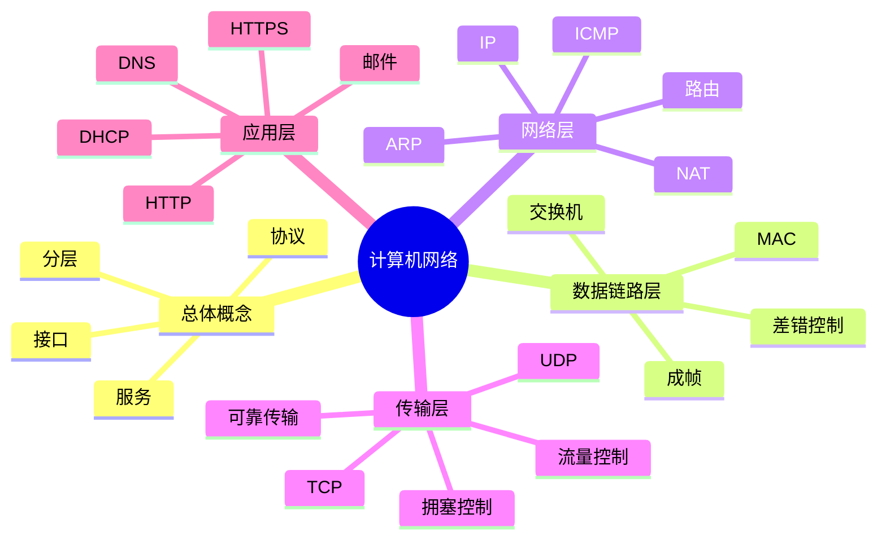
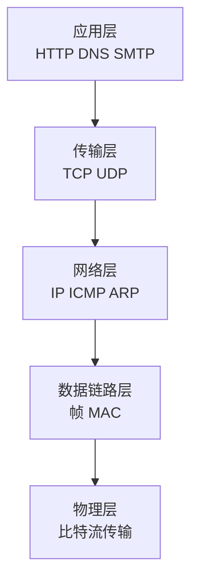
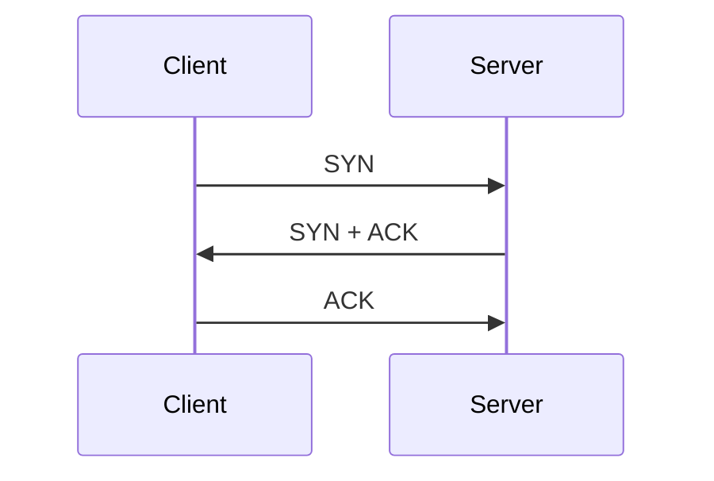
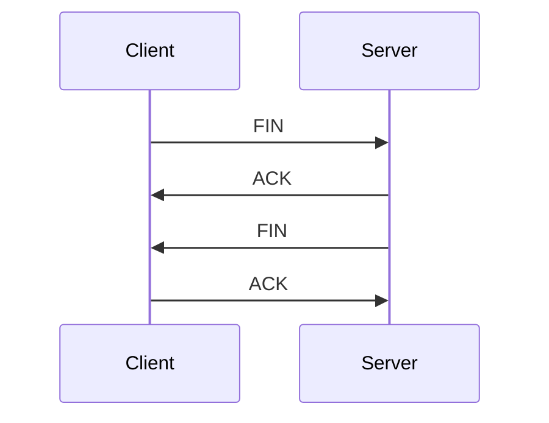

# 计算机网络

> 写作定位：以 408 主干知识为核心，兼顾面试中的协议理解与实际场景表达。  
> 目标读者：有一点计算机基础，希望把网络知识串成一条线。  
> 全局规范：见 `408笔记写作规范.md`

## 1. 本章学习目标

- 建立分层网络视角
- 重点掌握网络层、传输层、应用层主线
- 理解 TCP/IP 协议族的作用与关系
- 能应对 408 高频考点和基础网络面试题

## 2. 章节导图

## 3. 核心知识展开

### 3.1 先建立对网络的整体认识

很多同学学计算机网络时最大的困惑是：协议太多、缩写太多、层次太多，感觉像在背词典。

其实网络最核心的问题并不复杂，本质上就是一句话：

> **让一台主机上的数据，可靠或高效地送到另一台主机上的正确进程。**

这句话里包含了网络的几个核心问题：

- 数据怎么表示和封装
- 数据怎么从一台机器发出去
- 中间经过哪些设备
- 怎么找到目标主机
- 到了目标主机后交给哪个应用
- 传输过程中如何保证效率和可靠性

所以，网络不是一堆协议的堆砌，而是一套分工明确的协作体系。

### 3.2 为什么要分层

如果把网络通信的所有功能都塞进一个大模块里，会非常混乱：

- 改动困难
- 兼容性差
- 无法分工

所以网络采用“分层”思想，把复杂问题拆成多层，每层只负责一部分功能，并向上层提供服务。

#### 3.2.1 分层的好处

- 结构清晰
- 降低复杂度
- 便于标准化
- 某一层变化不必影响全部系统

#### 3.2.2 OSI 和 TCP/IP 怎么看

考试里会提 OSI 七层模型，但实际工程里更常说 TCP/IP 模型。

可以这样理解：

- OSI 更像理论参考模型
- TCP/IP 更像现实互联网采用的协议体系

常用学习视角一般按五层来讲：

- 物理层
- 数据链路层
- 网络层
- 传输层
- 应用层

#### 3.2.3 一张图看分层

从上往下看，是“数据一步步封装”；从下往上看，是“数据一步步解封装”。

### 3.3 数据在网络里是怎么走的

这是理解整本网络最关键的主线。

发送方发送一个 HTTP 请求时，并不是 HTTP 直接把内容送到对方浏览器，而是经历如下过程：

1. 应用层生成数据
2. 传输层加上 TCP/UDP 首部
3. 网络层加上 IP 首部
4. 数据链路层加上帧头帧尾
5. 物理层变成比特流传输

接收方则反过来解封装。

这条线一定要熟，因为很多题其实都在问：

- 某个功能属于哪一层
- 某个地址在哪一层使用
- 某个设备工作在哪一层

### 3.4 物理层：先把 0 和 1 送出去

物理层最底层，关注的是：

- 用什么介质传输
- 电信号、光信号怎么表示 0 和 1
- 比特如何同步传送

从 408 角度，这一层通常不要求太深的工程细节，更重要的是知道：

- 它只负责比特流传输
- 不关心“这个比特代表什么应用数据”

面试里一般不会深挖物理层实现，更多是让你知道网络是从比特级传输开始的。

### 3.5 数据链路层：让一跳传输更可靠

数据链路层解决的是“相邻节点之间”的传输问题。

也就是说，它更关心：

- 如何把一串比特组织成帧
- 怎么发现传输错误
- 在共享信道中如何协调发送

#### 3.5.1 帧是什么

帧可以理解成数据链路层的数据单位。

为什么需要帧？

因为物理层只管比特流，接收方需要知道：

- 一段数据从哪里开始
- 到哪里结束

这就是成帧的意义。

#### 3.5.2 差错控制

数据在传输中可能出错，所以链路层通常会通过校验机制来发现错误。

这里重点记住：

- 链路层可以发现差错
- 但“发现差错”和“端到端可靠传输”不是一回事

真正端到端可靠，核心还是传输层中的 TCP。

#### 3.5.3 MAC 地址

MAC 地址工作在数据链路层，用于标识网卡。

要分清几个地址：

| 地址 | 所在层 | 作用 |
| --- | --- | --- |
| MAC 地址 | 数据链路层 | 标识局域网中的网卡接口 |
| IP 地址 | 网络层 | 标识主机或路由位置 |
| 端口号 | 传输层 | 标识主机中的具体进程 |

这是网络里最经典的对比表之一。

#### 3.5.4 交换机工作在哪层

交换机主要工作在**数据链路层**，根据 MAC 地址转发帧。

你可以这样记：

- 集线器：更像物理层设备
- 交换机：链路层设备
- 路由器：网络层设备

#### 3.5.5 局域网和冲突域

交换机的出现，本质上是为了更高效地组织局域网通信。

在早期共享介质网络中，多个节点一起发数据容易冲突；交换机通过端口转发，把冲突范围缩小，提高效率。

### 3.6 网络层：负责把数据送到目标主机

网络层的任务，是在复杂网络中完成主机到主机的传输。

关键词有：

- IP 地址
- 路由选择
- 转发

#### 3.6.1 IP 地址的本质

IP 地址可以理解成网络中的“逻辑地址”，用于标识主机所在的位置。

它不像 MAC 地址那样绑定网卡硬件，而更偏向网络中的逻辑定位。

#### 3.6.2 为什么既有 MAC 又有 IP

因为它们解决的问题不同：

- MAC 负责“这一跳”怎么交付
- IP 负责“跨网络”怎么找到目标主机

简单说：

- MAC 更像门牌号里的“具体收件位置”
- IP 更像城市、街道、区域这种“路径定位”

#### 3.6.3 路由器在做什么

路由器工作在网络层，它的核心任务是：

- 看目标 IP
- 决定下一跳往哪走

所以路由器并不是“认识整个数据内容”，它主要关心如何把数据报沿着合适路径继续送下去。

#### 3.6.4 ARP：已知 IP，怎么找 MAC

在局域网通信中，如果主机知道目标 IP，但还不知道目标 MAC，就需要 ARP。

ARP 的作用可以一句话记住：

> **根据 IP 地址获取对应的 MAC 地址。**

它常见于“同一局域网内的下一跳定位”。

#### 3.6.5 ICMP：网络层里的辅助协议

ICMP 常用于：

- 差错报告
- 网络诊断

比如 `ping` 背后就和 ICMP 密切相关。

所以面试中如果问：

> ping 用到了什么？

一个基础而稳妥的回答是：它依赖 ICMP 来测试网络可达性和往返情况。

#### 3.6.6 子网划分的意义

子网划分本质上是在做两件事：

- 更合理地使用 IP 地址
- 降低广播范围，提高网络组织效率

考试中常见的是：

- 给你 IP 和子网掩码，判断网络号、主机号
- 判断两个主机是否在同一子网

#### 3.6.7 NAT 为什么重要

NAT（网络地址转换）在实际网络中非常常见，因为 IPv4 地址不够用。

它的核心作用是：

> 让多个内部私有地址主机，通过较少的公网地址访问外网。

面试时常问：

- 为什么家庭路由器后面多个设备都能上网

本质就和 NAT 有关。

### 3.7 传输层：把数据交给正确的进程

网络层只负责到达主机，而传输层要进一步解决：

- 到了主机后交给哪个应用进程
- 需不需要可靠传输
- 如何控制发送速度

这就是端口号、TCP、UDP 出场的地方。

#### 3.7.1 端口号的意义

一台主机上可能同时运行很多网络程序，比如浏览器、微信、数据库服务。

IP 地址能找到主机，但找不到具体进程，所以需要端口号。

一句话记忆：

> IP 定位主机，端口定位进程。

#### 3.7.2 UDP：简单、快、无连接

UDP 的核心特点：

- 无连接
- 尽最大努力交付
- 首部开销小
- 不保证可靠性
- 不保证有序

适合场景：

- 实时音视频
- DNS 查询
- 对少量丢包不敏感但重视时延的应用

#### 3.7.3 TCP：可靠、面向连接、面向字节流

TCP 是整个传输层最重要的协议。

它的关键词：

- 面向连接
- 可靠传输
- 面向字节流
- 全双工

所谓“面向连接”，就是通信前先建立连接，结束后再释放。

所谓“可靠传输”，指 TCP 会通过一系列机制尽量保证：

- 不丢
- 不重
- 有序

#### 3.7.4 TCP 和 UDP 的高频对比

| 维度 | TCP | UDP |
| --- | --- | --- |
| 连接方式 | 面向连接 | 无连接 |
| 可靠性 | 可靠 | 尽最大努力交付 |
| 有序性 | 保证有序 | 不保证 |
| 速度与开销 | 开销较大 | 开销较小 |
| 适用场景 | 文件传输、网页、数据库连接 | 音视频、DNS、直播等 |

这个表几乎是网络面试必问。

### 3.8 TCP 为什么可靠

很多同学会背“确认重传、序号、窗口、拥塞控制”，但如果不能串起来，还是容易乱。

可以把 TCP 的可靠性理解为五件事：

1. 给数据编号
2. 收到后确认
3. 没收到就重传
4. 按顺序重组
5. 控制发送速度，避免把对方和网络压垮

#### 3.8.1 序号与确认

TCP 给发送的数据分配序号，接收方通过确认应答告诉发送方：

- 哪些数据已经收到
- 下一次希望收到哪一段

这样发送方就知道是否需要重传。

#### 3.8.2 超时重传

如果发送方在一段时间内没有收到确认，就认为可能丢包，于是重传。

这就是 TCP 可靠性的基础机制之一。

#### 3.8.3 滑动窗口

如果每发一个报文段就停下来等确认，效率太低。

所以 TCP 采用滑动窗口，让发送方可以连续发送多个报文段，而不是“一问一答式”发送。

这大幅提升了传输效率。

#### 3.8.4 流量控制

流量控制是：

> **发送方别发太快，避免接收方来不及处理。**

它更多关注“接收方能不能吃得下”。

#### 3.8.5 拥塞控制

拥塞控制是：

> **别把整个网络发堵了。**

它关注的不是某个接收方，而是网络整体承载能力。

所以一定要区分：

- 流量控制：接收方视角
- 拥塞控制：网络视角

#### 3.8.6 TCP 三次握手

建立连接时，最经典的问题就是三次握手。

你不必把所有字段死背，但至少要理解它在确认两件事：

- 双方的发送能力和接收能力是否正常
- 双方是否都准备好建立连接

面试中常问：

- 为什么不是两次？

一个基础回答是：

> 两次无法让双方都确认“对方的收发能力”和“自己发出去的信息被对方收到”。

#### 3.8.7 TCP 四次挥手

连接释放时通常是四次挥手，因为 TCP 是全双工，双方的发送通道和接收通道要分别关闭。

#### 3.8.8 TIME_WAIT 为什么存在

这是面试高频。

一个相对稳妥的解释是：

- 确保最后一个 ACK 能让对方收到
- 防止旧连接中的延迟报文影响后续新连接

不需要一上来就背特别细的状态机，也能说得比较完整。

### 3.9 应用层：真正和用户需求直接相关

应用层距离用户最近，也是面试里最容易和实际项目连接的一层。

#### 3.9.1 DNS：把域名变成 IP

人更擅长记域名，不擅长记 IP，所以需要 DNS 做解析。

一句话记忆：

> DNS 的作用是把域名解析成 IP 地址。

DNS 常被问到的点：

- 为什么访问网站要先做 DNS 解析
- DNS 常用 UDP 还是 TCP

基础回答通常是：

- 一般查询常用 UDP，简单快速
- 某些场景下也可能使用 TCP

#### 3.9.2 HTTP：超高频协议

HTTP 是应用层协议，用于浏览器和服务器之间传输超文本及各种资源。

要掌握的核心点：

- HTTP 是无状态协议
- 基于请求-响应模型
- 常见方法有 GET、POST 等

#### 3.9.3 HTTP 为什么说无状态

因为协议本身默认不记录“上一次你是谁、做了什么”。

这带来好处：

- 简化服务器设计
- 更容易扩展

但也带来问题：

- 用户登录状态怎么保持？

这就需要 Cookie、Session、Token 等机制辅助。

#### 3.9.4 GET 和 POST 怎么答

不要只答“GET 用于查，POST 用于增”，那太粗糙。

更稳妥的说法是：

- GET 通常用于获取资源
- POST 通常用于提交数据
- 它们在语义、缓存、参数传递习惯等方面常有差别

基础面试中这样回答已经比较稳。

#### 3.9.5 HTTPS 比 HTTP 多了什么

HTTPS 可以理解成：

> **HTTP + TLS/SSL**

它的主要目标是：

- 加密传输内容
- 防止被窃听
- 防止被篡改
- 验证服务器身份

所以 HTTPS 的核心价值不是“更快”，而是“更安全”。

#### 3.9.6 DHCP：自动分配网络参数

DHCP 的作用是自动为主机分配：

- IP 地址
- 子网掩码
- 网关
- DNS 服务器等参数

现实中电脑接入网络后通常不需要手动配置，很大程度上就是因为 DHCP。

### 3.10 常见网络设备怎么区分

这也是非常适合表格化记忆的一块。

| 设备 | 主要工作层次 | 核心作用 |
| --- | --- | --- |
| 集线器 | 物理层 | 简单转发比特流 |
| 交换机 | 数据链路层 | 根据 MAC 地址转发帧 |
| 路由器 | 网络层 | 根据 IP 地址转发数据报 |

面试中经常问：

- 交换机和路由器有什么区别

你可以回答：

> 交换机主要解决局域网内基于 MAC 的转发，路由器主要解决跨网络基于 IP 的转发。

### 3.11 从浏览器输入 URL 到页面显示，网络发生了什么

这是网络面试中的“王牌大题”。

可以按这条线回答：

1. 浏览器先解析 URL
2. 查询 DNS，拿到目标 IP
3. 与服务器建立 TCP 连接（如果是 HTTPS，还要做 TLS 握手）
4. 浏览器发送 HTTP 请求
5. 数据经过封装，在网络中由交换机、路由器逐步转发
6. 服务器收到请求并返回 HTTP 响应
7. 浏览器解析 HTML、CSS、JS，渲染页面

这个问题特别适合检验你是否真正把分层思想串起来了。

### 3.12 把整本网络串成一条线

如果只背协议名字，网络会越学越乱；如果把它串成流程，就会清楚很多：

1. 应用层决定“我要传什么”
2. 传输层决定“怎么交给对方进程，是否可靠”
3. 网络层决定“怎么到目标主机”
4. 链路层决定“这一跳怎么发”
5. 物理层负责真正发送比特

这就是网络的总主线。

## 4. 高频考点总结

### 4.1 408 高频主线

- 分层思想与各层功能
- 数据封装与解封装过程
- MAC、IP、端口号的区别
- 交换机、路由器分别工作在哪层
- IP、ARP、ICMP、NAT 的作用
- TCP 与 UDP 的区别
- TCP 可靠传输机制
- 流量控制与拥塞控制
- 三次握手、四次挥手
- DNS、HTTP、HTTPS、DHCP 的作用

### 4.2 面试高频主线

- 从输入 URL 到页面显示发生了什么
- TCP 为什么可靠
- 为什么要三次握手、四次挥手
- HTTP 和 HTTPS 的区别
- TCP 和 UDP 怎么选
- 交换机和路由器区别
- DNS 解析过程在干什么
- 为什么需要 NAT

### 4.3 一张总表快速记忆

| 模块 | 最该记住的一句话 |
| --- | --- |
| 分层 | 把复杂通信拆成多层协作 |
| 链路层 | 负责一跳传输 |
| 网络层 | 负责主机到主机 |
| 传输层 | 负责进程到进程 |
| 应用层 | 直接服务应用需求 |
| MAC/IP/端口 | 分别定位网卡、主机、进程 |
| UDP | 简单快，但不可靠 |
| TCP | 连接、可靠、有序 |
| HTTP | 请求-响应、无状态 |
| HTTPS | HTTP 加安全保护 |

## 5. 易错点 / 易混点

### 5.1 OSI 七层和 TCP/IP 不要机械对位

考试会讲 OSI，实际更常讲 TCP/IP。学习时重要的是理解每层职责，而不是死背名字。

### 5.2 MAC 地址和 IP 地址不是二选一

它们不是互相替代关系，而是分别解决不同层次的寻址问题。

### 5.3 链路层可靠不等于端到端可靠

某一跳上能发现或处理错误，不代表整个源主机到目标主机的传输就一定可靠。

### 5.4 TCP 可靠不等于绝对不会丢

更准确地说，TCP 通过确认、重传、排序等机制尽量实现可靠交付。

### 5.5 流量控制和拥塞控制不要混

- 流量控制：防止接收方来不及处理
- 拥塞控制：防止网络本身被压垮

### 5.6 UDP 不等于“完全不能用”

UDP 虽然不可靠，但简单、快、时延低，在实时场景非常有价值。

### 5.7 HTTP 无状态不等于“网站不能登录”

只是 HTTP 协议本身不记录状态，实际可借助 Cookie、Session、Token 等机制实现状态保持。

### 5.8 HTTPS 的核心是安全，不是单纯更快

如果面试被问，优先从加密、认证、完整性保护这些角度回答。

## 6. 面试常问

### 6.1 TCP 和 UDP 有什么区别

**回答模板：**

TCP 面向连接、可靠传输、保证有序，适合网页访问、文件传输、数据库连接等对可靠性要求高的场景；UDP 无连接、首部开销小、时延低，但不保证可靠和有序，更适合实时音视频、直播、DNS 查询等场景。

### 6.2 TCP 为什么可靠

**回答模板：**

TCP 的可靠性主要来自序号、确认应答、超时重传、滑动窗口以及流量控制和拥塞控制。它通过给数据编号、确认收到情况、丢失时重传，并按序重组数据，尽量实现不丢不重且有序交付。

### 6.3 为什么需要三次握手

**回答模板：**

三次握手的本质是让通信双方都确认彼此的收发能力正常，并且双方都明确连接已经建立。两次握手通常不足以让双方都完成这种双向确认，所以 TCP 采用三次握手。

### 6.4 为什么挥手要四次

**回答模板：**

因为 TCP 是全双工通信，连接释放时双方的发送方向和接收方向需要分别关闭。一方先发 FIN 表示自己不再发送，另一方先 ACK，再在合适时机发送自己的 FIN，所以通常是四次挥手。

### 6.5 HTTP 和 HTTPS 有什么区别

**回答模板：**

HTTP 是明文应用层协议，请求和响应内容容易被窃听或篡改；HTTPS 在 HTTP 基础上加入 TLS/SSL，能够提供加密、完整性保护和身份认证，因此更安全。

### 6.6 从输入 URL 到页面显示发生了什么

**回答模板：**

浏览器先解析 URL，再进行 DNS 解析获取目标 IP，然后与服务器建立 TCP 连接；如果是 HTTPS，还会进行 TLS 握手。随后浏览器发送 HTTP 请求，请求经过链路层和网络层逐跳转发到服务器，服务器返回响应，浏览器再解析 HTML、CSS、JS 并渲染页面。

### 6.7 交换机和路由器有什么区别

**回答模板：**

交换机主要工作在数据链路层，根据 MAC 地址在局域网内转发帧；路由器主要工作在网络层，根据 IP 地址决定下一跳，实现跨网络的数据报转发。

## 7. 刷题与复习建议

### 7.1 按“分层”复习，而不是按协议碎片背

建议把所有知识点挂到五层模型上：

- 应用层有哪些协议
- 传输层解决什么问题
- 网络层负责什么
- 链路层和物理层分别干什么

这样记忆会特别稳。

### 7.2 优先吃透这几组高频对比

- MAC vs IP vs 端口
- TCP vs UDP
- 流量控制 vs 拥塞控制
- 交换机 vs 路由器
- HTTP vs HTTPS

### 7.3 练会“从流程讲网络”

网络最怕只会背定义，不会串流程。

至少要能完整讲出：

- 数据如何封装解封装
- TCP 建连断连过程
- 浏览器访问网站的大致流程

### 7.4 应对 408 的建议

- 分层模型一定要清
- 关键协议的职责要分清
- TCP 可靠性机制要能复述
- 三次握手、四次挥手、滑动窗口常考

### 7.5 应对面试的建议

回答网络问题时，尽量按“层次 + 流程 + 原因”来组织。

例如答“为什么 TCP 可靠”，不要只列名词，而要把序号、确认、重传、窗口如何配合讲成一条线。

## 8. 最后速记版

### 8.1 分层速记

- 应用层：面向用户需求
- 传输层：进程到进程
- 网络层：主机到主机
- 链路层：一跳一跳发
- 物理层：传比特

### 8.2 地址速记

- MAC：定位网卡
- IP：定位主机
- 端口：定位进程

### 8.3 协议速记

- ARP：IP 找 MAC
- ICMP：差错报告与诊断
- DNS：域名转 IP
- DHCP：自动分配网络参数
- HTTP：网页请求响应
- HTTPS：更安全的 HTTP

### 8.4 传输层速记

- UDP：快、轻、无连接
- TCP：可靠、连接、有序
- 流量控制：别把接收方压垮
- 拥塞控制：别把网络压垮

### 8.5 建连断连速记

- 三次握手：建立连接
- 四次挥手：释放连接
- TIME_WAIT：确保最后确认有效并隔离旧报文

### 8.6 网络设备速记

- 集线器：物理层
- 交换机：链路层
- 路由器：网络层

### 8.7 最后一句话总结

计算机网络最重要的不是把协议缩写全部背下来，而是建立一条稳定主线：

> 应用提出需求，传输层负责进程通信，网络层负责寻路，链路层负责逐跳交付，物理层负责真正发出去。

只要这条线是清楚的，很多零散知识点都会自动找到位置。
