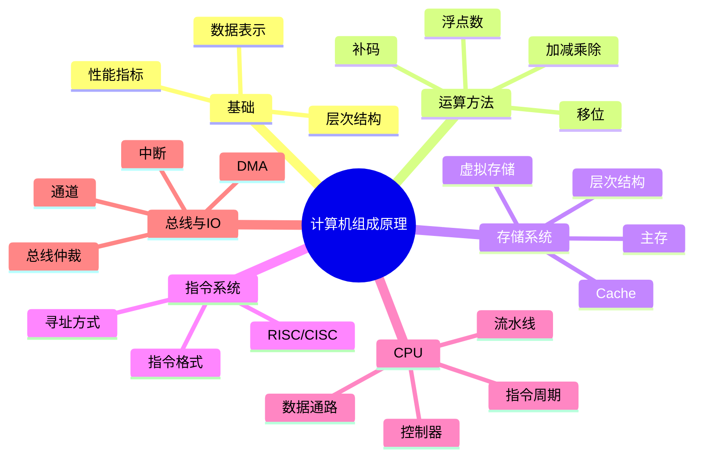
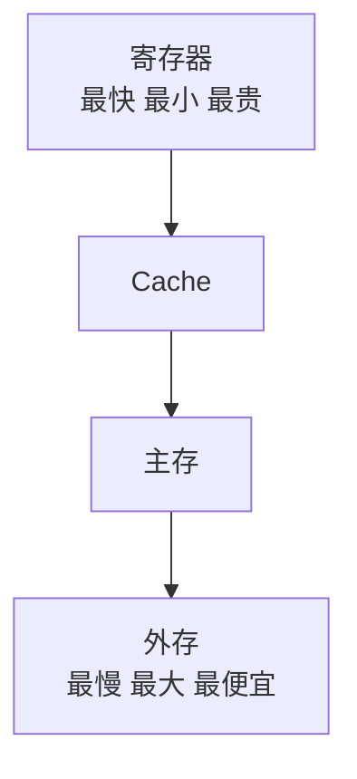

# 计算机组成原理

> 写作定位：保留 408 高频主干，弱化过难、过细、低频的枝节内容。  
> 目标读者：有一点基础，但希望把“硬件工作过程”真正讲明白。  
> 全局规范：见 `408笔记写作规范.md`

## 1. 本章学习目标

- 建立整机层次结构视角
- 理解数据表示、运算、存储、指令、CPU、总线、IO 主线
- 把“会做题”与“能解释原理”结合起来
- 提升对计组高频考点的整体把握

## 2. 章节导图

## 3. 核心知识展开

### 3.1 先建立对计组的整体认识

很多同学觉得计算机组成原理难，是因为它既不像数据结构那样偏“抽象逻辑”，也不像操作系统和网络那样偏“系统流程”，而是要同时理解：

- 数据在机器里怎么表示
- 指令怎么被执行
- CPU、内存、总线、IO 是怎么配合的

如果只背零散术语，计组会特别碎；但如果抓住主线，它其实很清楚：

> **计算机组成原理研究的是：一台计算机内部各个硬件部件如何组织起来，并协同完成程序执行。**

你可以把整机想象成一个工厂：

- CPU 是核心调度和计算中心
- 主存是工作台
- Cache 是手边的小抽屉
- 外存是大仓库
- 总线是运输通道
- IO 设备是与外界打交道的接口

程序运行时，本质上就是：

1. 指令和数据先存起来
2. CPU 取指令、译码、执行
3. 运算结果写回寄存器或内存
4. 必要时和外设交互

这就是整本计组的主线。

### 3.2 计算机系统的层次结构

#### 3.2.1 硬件和软件不是割裂的

从高到低可以大致理解为：

- 高级语言程序
- 汇编语言
- 机器语言
- 微程序/硬件控制

用户平时写的是高级语言，但计算机最终真正执行的是机器指令。

所以计组的价值就在于：让你知道“软件写下去以后，底层到底发生了什么”。

#### 3.2.2 冯·诺依曼结构

这是计组中最经典、最基础的模型。

冯·诺依曼思想可以概括为：

- 计算机由运算器、控制器、存储器、输入设备、输出设备组成
- 指令和数据都以二进制形式存放
- 指令和数据共享存储空间
- 程序按顺序执行

其中最重要的是“存储程序”思想，也就是：

> 程序本身也作为数据一样存放在存储器里，CPU 可以按地址把它取出来执行。

#### 3.2.3 现代计算机怎么看冯·诺依曼模型

虽然现代计算机非常复杂，但主干思想仍然沿用：

- 存储程序
- CPU 控制执行
- 指令和数据围绕存储器流动

所以学习计组，首先要把这条主线装进脑子里。

### 3.3 计算机的性能指标：别死背，要会理解

408 里会出现一些性能指标，常见的有：

- 主频
- 时钟周期
- CPI
- CPU 执行时间

#### 3.3.1 主频和时钟周期

主频可以理解成 CPU 时钟信号变化得有多快。

- 主频越高，通常说明单位时间内可能完成更多节拍
- 时钟周期是主频的倒数

但注意：

> 主频高不一定性能就一定强。

因为真正性能还受：

- 每条指令需要多少周期
- 流水线效率
- Cache 命中率
- 指令集设计

等很多因素影响。

#### 3.3.2 CPI 和 CPU 执行时间

CPI 表示平均每条指令需要的时钟周期数。

CPU 执行时间可以大致理解为：

> 指令条数 × 平均每条指令周期数 × 时钟周期

所以提升性能可以从多个方向入手：

- 减少指令数
- 降低 CPI
- 缩短时钟周期

这个思路在面试中也很有用。

### 3.4 数据表示：机器为什么只认识 0 和 1

硬件底层最稳定、最容易实现的就是二值逻辑，所以数据最终都要表示成二进制。

#### 3.4.1 为什么用二进制

主要原因有：

- 物理实现简单
- 抗干扰能力强
- 便于用逻辑电路实现运算

#### 3.4.2 机器数与真值

真值是人理解的数值本身，机器数是这个数在机器中的编码形式。

例如同样是一个负数，人脑看到的是“负三”，机器里看到的是它的补码表示。

#### 3.4.3 原码、反码、补码

这是计组最基础的高频内容。

| 表示方式 | 特点 |
| --- | --- |
| 原码 | 符号位 + 数值位，直观但不便于运算 |
| 反码 | 正数不变，负数符号位不变其余位取反 |
| 补码 | 在反码基础上加 1，是机器中最常用的有符号整数表示 |

为什么补码重要？

因为它可以让加法器同时处理加减法，统一硬件设计。

#### 3.4.4 为什么补码更适合机器

核心原因不是“定义就是这样”，而是：

- 负数表示统一
- 加减法电路实现更方便
- 0 的表示更统一

所以面试如果问“为什么计算机用补码”，优先从**简化硬件电路和统一运算**回答。

#### 3.4.5 移位与溢出

移位常和乘除 2 的幂联系起来：

- 左移一位，通常近似乘 2
- 右移一位，通常近似除 2

但要注意：

- 有符号数和无符号数移位要区分
- 左移可能溢出

#### 3.4.6 浮点数只掌握核心直觉

浮点数是用来表示很大或很小、范围变化大的实数。

它的核心思想类似科学计数法：

> 数值 = 尾数 × 基数的指数次幂

408 会考浮点数表示、规格化等内容，但从应试性价比和实用理解角度，最重要的是知道：

- 浮点数兼顾范围和精度
- 但会有精度误差
- 不是所有小数都能被精确表示

这也是为什么很多语言里会有“小数比较不要直接用 `==`”的问题。

### 3.5 运算器：数据是怎么被算出来的

运算器是 CPU 里的重要组成部分，核心部件通常是 ALU（算术逻辑单元）。

它主要负责：

- 加减运算
- 与或非等逻辑运算
- 移位
- 比较

#### 3.5.1 加法器为什么重要

因为很多更复杂的运算，都可以转化或部分转化为加法。

例如：

- 减法可以转成加补码
- 乘法可以和移位、累加结合
- 除法也可转成逐步减法和移位思路

所以“补码 + 加法器”的组合，是机器运算的根。

#### 3.5.2 标志位要理解含义

运算后，CPU 常会设置一些标志位，用于反映结果特征，例如：

- 是否为零
- 是否进位
- 是否溢出
- 是否为负

这些标志位后续会影响条件转移等指令执行。

从面试角度，不一定需要死记所有细节，但要知道：

> CPU 不仅算结果，还会记录结果的一些状态信息。

### 3.6 存储系统：计组里最重要的一大块

存储系统是计组的重头戏，因为程序和数据都离不开存储。

#### 3.6.1 为什么要有层次化存储

理想情况当然是：

- 像寄存器一样快
- 像磁盘一样大
- 还像磁盘一样便宜

但现实中做不到，所以就有了分层存储。

这体现的是经典矛盾：

- 速度
- 容量
- 成本

不能同时最优，只能分层折中。

#### 3.6.2 局部性原理是存储层次的理论基础

局部性原理包括：

- 时间局部性：刚访问过的内容还可能很快再访问
- 空间局部性：访问某个位置后，附近位置也可能很快被访问

正因为存在局部性，才可以用小而快的存储器去提升整体平均性能。

#### 3.6.3 主存、Cache、外存怎么分工

| 层次 | 特点 | 作用 |
| --- | --- | --- |
| 寄存器 | 最快，容量最小 | CPU 直接操作 |
| Cache | 很快，容量较小 | 缓解 CPU 与主存速度差 |
| 主存 | 中间层 | 程序运行时的主要工作区 |
| 外存 | 慢但大 | 长期保存数据 |

#### 3.6.4 SRAM 和 DRAM

这是高频对比。

| 类型 | 特点 | 常见用途 |
| --- | --- | --- |
| SRAM | 速度快，成本高，集成度低 | Cache |
| DRAM | 速度较慢，容量大，成本低 | 主存 |

记忆方法：

- Cache 更追求快，所以常用 SRAM
- 主存更追求容量和成本平衡，所以常用 DRAM

#### 3.6.5 Cache 为什么能提升性能

因为 CPU 访问数据时，如果所需内容正好在 Cache 中，就不用去更慢的主存找了。

这称为 Cache 命中。

所以 Cache 的关键指标常包括：

- 命中率
- 命中时间
- 失效代价

#### 3.6.6 Cache 的映射方式只抓主干

常见映射方式：

- 直接映射
- 全相联映射
- 组相联映射

从理解角度：

- 直接映射：实现简单，但冲突可能更明显
- 全相联：灵活，但硬件复杂
- 组相联：折中方案，实际很常见

#### 3.6.7 存储器性能怎么看

常见考法会涉及：

- 存取时间
- 存取周期
- 带宽

简化理解：

- 存取时间：发出请求到数据可用花多久
- 存取周期：两次独立访问最小间隔
- 带宽：单位时间能传多少数据

### 3.7 指令系统：CPU 听得懂的语言

指令系统描述了 CPU 能执行哪些基本操作，以及这些指令如何编码。

#### 3.7.1 指令由什么组成

一条指令通常至少包含两类信息：

- 操作码：做什么
- 地址码：对谁做

比如：

- 加法
- 装入
- 存储
- 跳转

#### 3.7.2 为什么要有寻址方式

因为操作数不一定都直接写在指令里，它可能：

- 在寄存器里
- 在内存里
- 就在指令本身里

寻址方式就是告诉 CPU：**该去哪里找操作数**。

#### 3.7.3 常见寻址方式

| 寻址方式 | 直觉理解 |
| --- | --- |
| 立即寻址 | 操作数直接写在指令里 |
| 直接寻址 | 指令中给出内存地址 |
| 间接寻址 | 指令给的不是数据地址，而是地址的地址 |
| 寄存器寻址 | 操作数在寄存器里 |
| 寄存器间接寻址 | 寄存器里存的是地址 |

考试里经常会比较这些方式的：

- 速度
- 灵活性
- 指令长度

#### 3.7.4 RISC 和 CISC

这是面试中高频出现的两个概念。

| 类型 | 特点 |
| --- | --- |
| CISC | 指令复杂、种类多，单条指令功能较强 |
| RISC | 指令更精简、格式更规整，强调高效流水执行 |

基础回答时可以说：

- CISC 更强调“少而强”的复杂指令
- RISC 更强调“简单规整，便于流水和优化”

不需要一开始就展开到太细。

### 3.8 CPU：程序真正执行的核心

CPU 是整机的核心。它通常由：

- 运算器
- 控制器
- 寄存器组

等部分组成。

#### 3.8.1 控制器在做什么

控制器像“指挥中心”，负责：

- 取指令
- 分析指令
- 发出控制信号
- 协调各部件动作

所以 CPU 并不是“只会算”，它还负责组织整机动作。

#### 3.8.2 几个关键寄存器

常见要掌握：

- PC：程序计数器，存下一条指令地址
- IR：指令寄存器，存当前指令
- MAR：存储器地址寄存器，存要访问的地址
- MDR：存储器数据寄存器，存读写的数据

这几个寄存器是高频重点。

#### 3.8.3 指令周期

一条指令执行通常会经历：

1. 取指
2. 译码
3. 执行

有些情况下还会细分出：

- 访存
- 写回

这条线非常关键，因为它帮助你把“程序运行”理解为一连串硬件动作。

#### 3.8.4 数据通路怎么理解

数据通路本质上是：

> 数据在 CPU、寄存器、ALU、存储器之间流动的路径。

控制器发控制信号，数据通路负责真正搬运和处理数据。

如果你能理解“控制信号负责指挥，数据通路负责执行”，计组会顺很多。

### 3.9 流水线：提高吞吐，不是缩短单条指令时间

流水线是计组里很容易被问的一个点。

#### 3.9.1 流水线的核心思想

把一条指令执行分成若干阶段，让多条指令在不同阶段并行推进。

就像工厂流水线：

- 第一件产品在第二工位时
- 第二件产品已经可以进入第一工位

所以流水线提升的是**吞吐率**，不是让单条指令一定更快完成。

#### 3.9.2 流水线可能遇到什么问题

常见三类相关风险：

- 结构相关：硬件资源冲突
- 数据相关：后一条指令依赖前一条结果
- 控制相关：分支跳转导致后续取指不确定

考试中通常考理解；面试中则常问：

- 为什么分支预测重要

本质上就是为了减少控制相关带来的停顿。

#### 3.9.3 流水线和并行不要混

流水线更像“分阶段重叠执行”，并不等于多核并行。

### 3.10 总线：部件之间的数据通道

整机里有很多部件，彼此之间需要通信，这就要靠总线。

#### 3.10.1 总线是什么

总线可以理解成多个部件共享的一组传输线。

通常会分为：

- 数据总线
- 地址总线
- 控制总线

| 总线类型 | 作用 |
| --- | --- |
| 数据总线 | 传输数据 |
| 地址总线 | 指出访问哪个单元 |
| 控制总线 | 传输读写、中断等控制信号 |

#### 3.10.2 为什么总线需要仲裁

因为同一时刻可能有多个部件都想使用总线。

这时就要决定：

- 谁先用
- 谁后用

这就是总线仲裁。

理解上不用陷入过多细枝末节，只要知道它解决“共享通道竞争”问题即可。

### 3.11 输入输出系统：计算机和外界如何交互

计算机不能只在内部算，还必须与外设交换信息。

#### 3.11.1 IO 为什么麻烦

因为外设和 CPU 在很多方面差异很大：

- 速度差异大
- 数据格式可能不同
- 控制方式不同

所以需要专门的 IO 系统做协调。

#### 3.11.2 程序查询、中断、DMA

这是 IO 部分最重要的主线。

| 方式 | 特点 |
| --- | --- |
| 程序查询方式 | CPU 主动不断检查设备状态，简单但效率低 |
| 中断方式 | 设备就绪后通知 CPU，CPU 不用一直等待 |
| DMA 方式 | 由 DMA 控制器负责内存与设备间的大块数据传输 |

这个表和操作系统中的 IO 部分可以互相印证。

#### 3.11.3 为什么 DMA 很重要

因为如果每个字节传输都让 CPU 亲自参与，会极大浪费 CPU 时间。

DMA 的价值就在于：

- 大块数据搬运更高效
- CPU 可以去做别的事

#### 3.11.4 中断怎么理解

中断可以理解为一种“打断当前执行，先处理紧急事件”的机制。

它不仅在 IO 中重要，在整机控制中也很关键。

### 3.12 把整本计组串成一条线

如果你想真正学懂计组，一定要把它串成流程，而不是背散点：

1. 程序和数据以二进制形式存储在存储器中
2. CPU 通过 PC 找到下一条指令
3. 控制器完成取指、译码、发控制信号
4. 数据通路在寄存器、ALU、存储器之间搬运并计算数据
5. Cache/主存/外存共同组成层次化存储体系
6. 总线负责部件间通信
7. IO 系统负责与外部设备交换数据

这就是一台计算机工作的主线。

## 4. 高频考点总结

### 4.1 408 高频主线

- 冯·诺依曼结构与存储程序思想
- 补码表示及其意义
- 定点数、浮点数基本表示
- 存储系统层次结构与局部性原理
- SRAM 与 DRAM 区别
- Cache 的作用与映射思想
- 指令格式与寻址方式
- CPU 组成、关键寄存器、指令周期
- 流水线基本思想及相关问题
- 总线分类与 IO 控制方式

### 4.2 面试高频主线

- 为什么计算机使用二进制
- 为什么使用补码
- Cache 为什么能提升性能
- SRAM 和 DRAM 有什么区别
- CPU 是怎么执行一条指令的
- 流水线为什么能提高性能
- RISC 和 CISC 有什么区别
- 中断和 DMA 分别解决什么问题

### 4.3 一张总表快速记忆

| 模块 | 最该记住的一句话 |
| --- | --- |
| 冯·诺依曼 | 程序和数据都存储，CPU 顺序取指执行 |
| 补码 | 统一机器加减运算，简化硬件 |
| 存储层次 | 用小而快的存储器提升平均性能 |
| Cache | 利用局部性减少访问主存次数 |
| 指令系统 | 规定 CPU 能做什么以及怎么编码 |
| CPU | 取指、译码、执行的核心 |
| 流水线 | 提高吞吐率，不是单条指令绝对更快 |
| 总线 | 各部件共享的数据通道 |
| 中断 | 让 CPU 及时处理外部事件 |
| DMA | 大块数据搬运尽量少占 CPU |

## 5. 易错点 / 易混点

### 5.1 主频高不等于性能一定强

真正性能还受 CPI、Cache、流水线、体系结构等影响。

### 5.2 原码、反码、补码不要只机械背定义

更重要的是理解：补码的价值在于统一运算和简化硬件实现。

### 5.3 左移不一定永远安全

左移虽然常可看作乘 2，但可能造成溢出。

### 5.4 Cache 不是主存的一部分替代品

更准确地说，Cache 是为了弥补 CPU 和主存速度差距而加入的高速缓冲层。

### 5.5 SRAM 和 DRAM 不要只背“一个快一个慢”

还要记住：

- SRAM 常用于 Cache
- DRAM 常用于主存

### 5.6 流水线提升的是吞吐率

不要简单理解成“每条指令都更快执行完”。

### 5.7 PC 不存当前指令内容

PC 存的是下一条指令地址；当前指令内容通常在 IR 中。

### 5.8 中断和 DMA 都能减轻 CPU 负担，但方式不同

- 中断：设备就绪后通知 CPU 来处理
- DMA：大块传输由 DMA 控制器负责

### 5.9 指令和数据在冯·诺依曼结构中共享存储

这一点常与“哈佛结构”混淆，复习时要分清。

## 6. 面试常问

### 6.1 为什么计算机用二进制

**回答模板：**

因为二进制在硬件上最容易实现，只有高低电平两种稳定状态，抗干扰能力也强，同时便于用逻辑电路完成算术和逻辑运算，所以计算机底层普遍采用二进制表示数据。

### 6.2 为什么计算机使用补码

**回答模板：**

补码的核心价值在于统一了加减法运算，使硬件可以主要通过加法器来完成有符号数运算，从而简化电路设计。另外补码对零的表示更统一，因此非常适合机器内部表示有符号整数。

### 6.3 Cache 为什么能提升性能

**回答模板：**

因为程序运行通常具有时间局部性和空间局部性，CPU 近期访问过的数据和附近的数据很可能再次被访问。Cache 比主存更快，把热点数据放在 Cache 中，可以显著减少访问主存的次数，从而提升平均访问速度。

### 6.4 SRAM 和 DRAM 有什么区别

**回答模板：**

SRAM 速度更快，但成本更高、集成度更低，常用于 Cache；DRAM 速度较慢，但容量更大、成本更低，常用于主存。它们分别服务于不同的性能与成本目标。

### 6.5 CPU 是怎么执行一条指令的

**回答模板：**

CPU 通常先根据 PC 取出指令，放入指令寄存器，再对指令进行译码，明确操作类型和操作数位置；随后控制器发出控制信号，通过数据通路完成运算、访存或写回等操作，最后更新 PC，准备执行下一条指令。

### 6.6 流水线为什么能提高性能

**回答模板：**

流水线把指令执行拆成多个阶段，让多条指令在不同阶段重叠推进，因此提升的是单位时间内完成的指令数量，也就是吞吐率。不过它也会遇到结构相关、数据相关和控制相关等问题。

### 6.7 RISC 和 CISC 有什么区别

**回答模板：**

CISC 强调功能较强、种类较多的复杂指令；RISC 强调简单、规整、便于流水线和编译优化的指令体系。可以把它理解为“复杂指令少写代码”和“简单指令更利于高效执行”之间的不同设计取向。

### 6.8 中断和 DMA 的区别是什么

**回答模板：**

中断是设备在需要处理时通知 CPU，由 CPU 介入后续工作；DMA 则更进一步，让设备和内存之间的大块数据传输主要由 DMA 控制器完成，CPU 不需要逐字参与，因此效率更高。

## 7. 刷题与复习建议

### 7.1 先抓四条主线

建议复习时先抓这四条：

- 数据表示
- 存储系统
- 指令系统与 CPU
- 总线与 IO

计组最怕东一块西一块，主线抓住后，很多细节才能挂住。

### 7.2 用“数据流动”理解知识点

看到一道计组题时，可以问自己：

- 数据现在在哪里
- 要去哪里
- 经过哪些部件
- 谁发控制信号

这个思路特别有助于理解 CPU、总线、存储、IO。

### 7.3 高效背诵这些经典对比

- 原码 / 反码 / 补码
- SRAM / DRAM
- Cache / 主存 / 外存
- RISC / CISC
- 中断 / DMA

### 7.4 应对 408 的建议

- 补码和溢出相关概念要清楚
- Cache 和局部性一定要串起来
- 关键寄存器功能要记牢
- 指令周期和流水线思想要能复述
- IO 控制方式常考表格对比

### 7.5 应对面试的建议

回答计组问题时，尽量少背定义，多讲“为什么这样设计”。

比如被问“为什么要有 Cache”，不要只说“因为快”，而要说是为了缓解 CPU 与主存之间的速度差，并利用程序局部性提升平均访问效率。

## 8. 最后速记版

### 8.1 基础速记

- 计组研究：硬件部件如何协同执行程序
- 冯·诺依曼：程序和数据同存，按地址取指执行

### 8.2 数据表示速记

- 二进制：硬件实现简单
- 补码：统一加减法，简化电路
- 浮点数：表示范围大，但有精度误差

### 8.3 存储系统速记

- 寄存器最快
- Cache 用于缓解 CPU 和主存速度差
- 主存是运行主战场
- 外存容量大、速度慢
- 局部性是层次存储的理论基础

### 8.4 CPU 速记

- PC：下一条指令地址
- IR：当前指令
- MAR：访问地址
- MDR：读写数据
- 指令周期：取指、译码、执行

### 8.5 流水线速记

- 核心：阶段重叠
- 目标：提升吞吐率
- 风险：结构相关、数据相关、控制相关

### 8.6 总线与 IO 速记

- 数据总线传数据
- 地址总线传地址
- 控制总线传控制信号
- 程序查询最费 CPU
- 中断更灵活
- DMA 更适合大块传输

### 8.7 最后一句话总结

计算机组成原理最重要的不是把所有底层细节背成碎片，而是建立一个稳定画面：

> 程序和数据先被存起来，CPU 再通过寄存器、控制器、运算器、存储器和总线一步步把指令执行出来。

只要这个“硬件协同执行”的画面清楚，计组就不再只是硬背。
